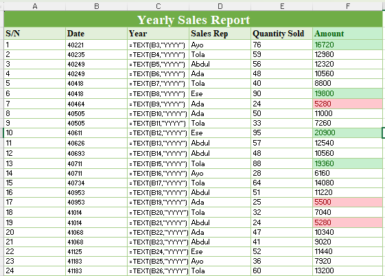
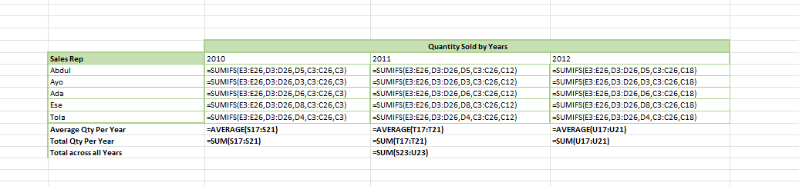
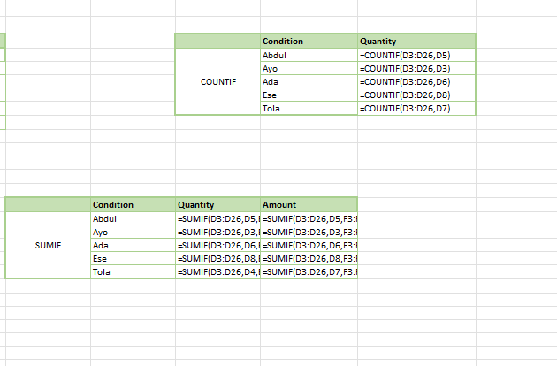

# Kabir Sales Analysis

## Executive Summary

The sales data shows a gradual decline in overall performance between 2010 and 2012. Both the quantity of goods sold and total sales revenue generally decreased across the years for most sales representatives, indicating weakening sales activity over time.

However, Tola stood out as an exception, showing a steady increase in both sales quantity and revenue throughout the period. Overall, the business appears to be experiencing declining performance, despite Tola’s consistent improvement in both sales quantity and revenue over the years.

## Visual Evidence

### Representative Performance Table
#### This table shows individual sales transaction including the quantity sold and amount. Formulas are displayed to validate calculations.

### Yearly Summary Table
#### This table aggregates total revenue per year, clearly showing the trend in sales.

### Quantity Sold Per Year
#### This table shows the quantity sold per year for each sales representative

### Additional Performance View
#### This table includes calculations such as total revenue per sales representative and transaction count using functions like SUMIF and COUNTIF

## Business Recommendations
#### Efficiency Analysis

Based on the analysis, there is no sales representative who has the highest transaction count without also having the highest revenue. Tola leads in both transaction volume and total revenue across the years, indicating both high activity and strong revenue efficiency.
However, Ada stands out as an exception. Despite having more transactions (5) compared to Ese (3), Ada generated less revenue. This suggests that Ada’s transactions were of lower value on average.
A possible explanation is inconsistency in performance, as Ada recorded no sales in 2011. This gap may have affected overall revenue contribution, and it also indicates that a higher number of transactions does not necessarily translate to higher revenue without strong deal value.
Overall, sales performance suggests that revenue is more closely tied to transaction quality than transaction volume.

### Trend Analysis (2010–2012)

The yearly performance shows a fluctuating sales trend rather than a consistent increase or decrease. Sales do not follow a steady upward growth pattern, and there are periods of both improvement and decline across the years.
Based on this irregular performance, the company should focus on maintaining its current staffing level in 2013 rather than immediately hiring more staff or reducing the workforce. The priority should be improving sales consistency and identifying factors driving the fluctuations before making expansion or downsizing decisions.

